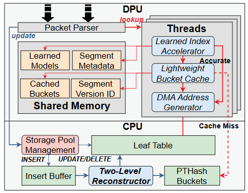

<!-- [](https://github.com/jermp/pthash/actions/workflows/codeql.yml) -->


Introduction
----
LMPTHASH is an index structure developed by the group for managing PB-level data mapping tables in DPU. It combines learning-based indexing, perfect hashing tables. By leveraging the continuity of logical addresses, it improves the spatial efficiency and query speed of the index.

Based on LMPTHASH index structure, we build `HiDPU` which offload the inner index to the DPU and use the techniques such as parallel memory access and caching to improve index lookup efficiency. 

Since DPU code rely on specific microcode to call the hardware accelerator, we designed and provide the `HiDPU Simulator` to simulate the behavior of HiDPU in a CPU-only environment. Within Simulator, HiDPU also integrates baseline index structures: `Three-level Page Table`, `Learned Table` and `LearnedFTL`.


<p align="center">
  
  <br>
  <em>Architecture of HiDPU</em>
</p>


## Supported Environments
- **Operating System**: Linux, macOS, Windows (with WSL)
- **C/C++ build environment is needed**: 
  - CMake >= 3.5
  - GCC >= 7.0 or Clang with C++17 support


## 1. Build and Compile

```
git clone https://github.com/quieoo/lmpthash.git
cd lmpthash
chmod +x build.sh
./build.sh
```
It will compile the LMPTHASH library (output to `build/libclmpthash.a`) and the HiDPU Simulator(output to `example/build/hidpu`).


## 2. Prepare the Trace File

Currently, we support the following trace types:

- **`msr`**: MSR-Cambridge trace
- **`random`**: Randomly generated trace
- **`femu`**: Trace captured by running FEMU and recording the LPNs accessed by the guest OS. Each line in the FEMU trace looks like this: `data time lpn`. If you want to generate trace files for different upper-layer applications, you can refer to and use [our other library](https://github.com/quieoo/FEMU_Trace.git).

Please note that the randomly generated trace does not maintain LPN continuity, which is uncommon in traditional storage systems. As a result, the performance of **LearnedTable** and **LMPTHASH** may degrade in this case. Therefore, we recommend downloading and using the **MSR trace** files instead.

### Downloading the MSR Trace Files:

- **Option 1: Download via Browser**

  Download the trace file from [cloud driver](https://drive.google.com/file/d/1Y8N1t3A4diZ_zhVkpvQ0nxhkiJxdkqGi/view?usp=sharing) and place the downloaded `mst.tar` file in the `trace` directory.

- **Option 2: Download via `gdown` Command (requires `pip` installed)**

  Use the following commands to download the MSR trace file:
  ```bash
  pip install gdown
  mkdir trace
  cd trace
  gdown 'https://drive.google.com/uc?id=1Y8N1t3A4diZ_zhVkpvQ0nxhkiJxdkqGi'
    ```
### Decompress the File:
Once the file is downloaded, extract it with the following commands in the `trace` directory:
```
tar -xvf mst.tar
```


## 3. Simply run the scripts

We have provided two pre-configured scripts, `run_small_trace.sh` and `run_large_trace.sh` to guide you through the process of running experiments with different trace files. These scripts contain the necessary commands to build the index, which test the program's functionality, including performance and functionality tests for different types of indexes, as well as scalability and reconstruction tests for HiDPU. Run the scripts as follows:
```
chmod +x run_small_trace.sh
./run_small_trace.sh
```
or
```
chmod +x run_large_trace.sh
./run_large_trace.sh
```

## 4. Usage instructions

### Minimal working example with lmpthash Library 

The following is an example of how to use the LMPTHASH library, which can also be found at `examples/clmpthash_test.c`:
```
#include "../include/clmpthash.h"
#include <stdio.h>
#include <stdlib.h>
#include <time.h>
#include <unistd.h>
#include <pthread.h>
#include <stdatomic.h>

int main(){
    char* config_path="random_config";  // config file path
    clmpthash_config cfg;
    clmpthash_lva* uniq_lpns;
    clmpthash_physical_addr* ppns;
    clmpthash_lva* lpns;
    uint64_t num_uniq_lpn, num_total_lpn=100000;    // randomly generate 100000 LPNs

    // generate random LPNs, make sure all lpns are unique and sorted in uniq_lpns
    // first 8 bytes of each ppn is set the value of the corresponding lpn
    clmpthash_parse_configuration(config_path, &cfg, &uniq_lpns, &ppns, &num_uniq_lpn, &lpns, &num_total_lpn);

    // build LMPTHASH index
    void* index = clmpthash_build_index(uniq_lpns, ppns, num_uniq_lpn, &cfg);
    if (index == NULL) {
        printf("error building index\n");
        return -1;
    }

    int all_passed = 1;
    clmpthash_physical_addr pa;
    for (uint64_t i = 0; i < num_total_lpn; ++i) {
        int ret = clmpthash_get_pa(lpns[i], index, &pa);

        // check if the result is correct
        if (ret == 0) {
            clmpthash_lva _lva = 0;
            for (int j = 0; j < 8; j++) { _lva = (_lva << 8) + pa.data[j]; }
            if (_lva != lpns[i]) {
                printf("wrong result: should be 0x%lx, but got 0x%lx\n", lpns[i], _lva);
                all_passed = 0;
                break;
            }
        } else {
            printf("error getting pa\n");
            all_passed = 0;
            break;
        }
    }
    if (all_passed) {
        printf("all tests passed\n");
    }
    clmpthash_clean_index(index);
    clmpthash_clean_bufs(uniq_lpns, ppns, lpns);
    return 0;
}
```

Build the example and link the library:
```
cd example
gcc -o ctest clmpthash_test.c -L../build -lclmpthash -lstdc++ -lm -lpthread
```

### Configure the index

Build the index requires a configuration file, which contains the parameters of the index. The next is an example of a configuration file:
```
alpha 0.5
beta 0.5
gamma 0.5
P 1000
hashed_num_bucket_c 6.0
table_size_alpha 0.99
max_bucket_size 10
pilot_search_threshold 65536
dynamic_alpha 1
alpha_limits 0.8
left_epsilon 1
right_epsilon 100
trace_type msr
trace_path ../trace/MSR-Cambridge/wdev_0.csv
CMT_MB 2.76
```
Among those the parameters, `trace_type` and `trace_path` describe the trace file used to create index and run the queries. Note the `trace_path` should be the absolute path or the relative path from the executable file. 

`CMT_MB` is the size of the Cached Mapping Table in MB, which is used to adjust the memory usage and performance of `LearnedFTL`(one of state of the art FTL index structures). 

Other parameters can remain by default, and the meaning of each parameter can be found in [here](include/clmpthash.h).


### HiDPU Simulator

#### 

#### Three-level Page Table

Run the following command to build and test three-level page table on given trace file:
```
./build/hidpu pagetable <num_threads> <config_path>
```

#### Learned Table
Run the following command to build and test three-level page table on given trace file:
```
./build/hidpu learnedtable <num_threads> <config_path>
```

#### HiDPU with Reconstruction and Multi-threads
When testing HiDPU, you can specify the number of threads and whether to reconstruct the index during queries. This can be used to test the hit rate of the pilot cache under different thread counts and to assess the impact of index reconstruction on program correctness.

Run the following command to build and test HiDPU on given trace file:
```
./build/hidpu lmpthash <num_threads> <if_reconstruction> <config_path>
```

`if_reconstruction` indicate whether to do `LocalReconstruction` during the query, if so the value should be `1`, otherwise `0`.

#### Scalability Test
Extend the original trace with a given `scale_factor` while maintaineing the same access pattern. The extended trace is used to build the index, while index size are reported.
```
./build/hidpu scalability <scale_factor> <config_path>
```

#### Comparison with LearnedFTL
We've also implemented the [LearnedFTL](https://github.com/astlxmu/LearnedFTL) into HiDPU Simulator for comparison. Run the following to build and test LearnedFTL on given trace file:
```
./build/hidpu learnedftl <num_threads> <config_path>
```

For LearnedFTL, the SSD capacity is configured as 1TB with a 4KB page size. Other parameters are set according to the specifications in the paper (e.g., the total index size, including the bitmap, CMT, and learned models, is set to 3% of the mapping table size).

Note that we could change the Cached Mapping Table(CMT) size through setting `CMT_MB` in the config file.

## License

This project is licensed under the MIT License - see the [LICENSE](LICENSE) file for details.
